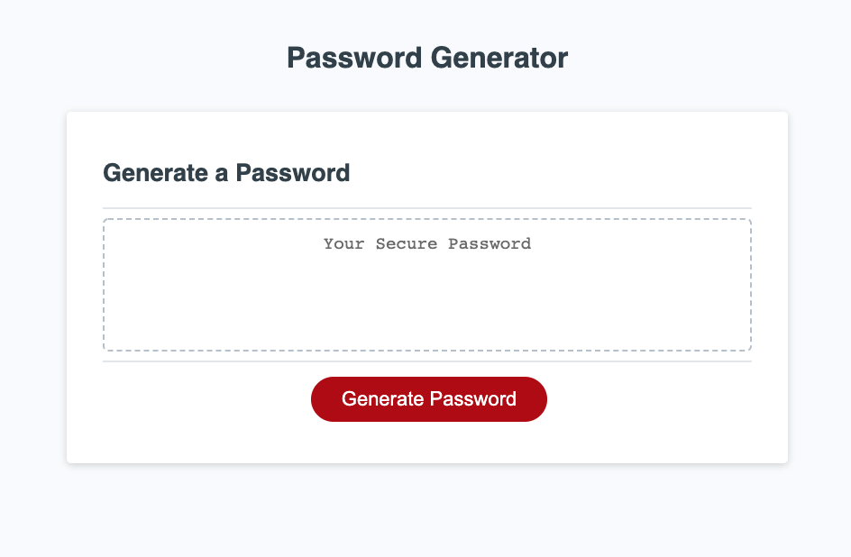

# Password-Generator

Password Generator is an application that allows users to select criteria including the length of the password and which type of characters they would like in their generated password. These criteria include special characters, numbers, uppercase, and lowercase letters. This application uses Javascript to generate a password using many concepts such as arrays, window prompts, functions, objects, for-loops, and much more!

## Screenshot

